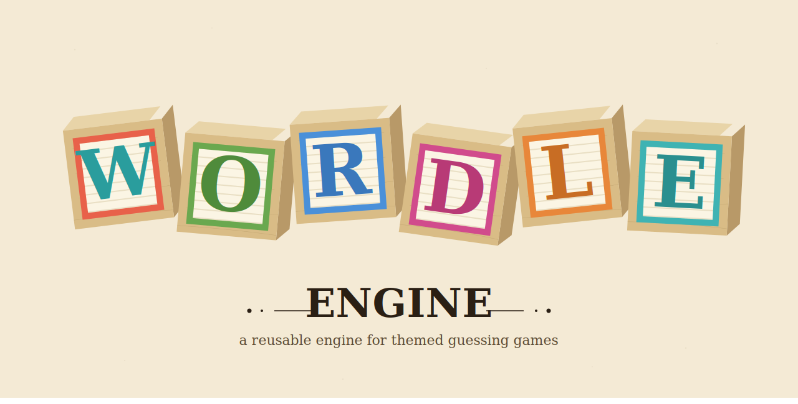

# Wordle Engine


[](./LICENSE)




A reusable, client-side game engine for themed Wordle-style guessing games. Build a football Wordle, a celebrity Wordle, a historical figures Wordle — swap the JSON, keep the engine.

**[Play the demo →](https://ciroalo.github.io/wordle-engine/)**

## What Makes This Different

This is not a Wordle clone. It is a **game engine** designed to power many themed guessing games from a single codebase. The engine is fully generic — it discovers categories, values, and word shapes from the dataset at load time. Variable-length words, compound names, and custom attribute systems are all handled automatically.

The engine logic is written as pure TypeScript with zero framework dependencies. React is used only as a thin rendering layer on top.

## Features

- **Variable-length words and compound names** — single words, two-word names, hyphenated names all work
- **Category-based filtering** — OR within categories, AND across categories, auto-derived from the dataset
- **Progressive hint system** — 5 hints per word, hover to preview, click to pin
- **Full Wordle feedback** — correct duplicate-letter handling
- **Animations** — tile pop, flip reveal, row shake, win bounce
- **Dark & light themes** — toggle in the header
- **Responsive** — adaptive tile sizing, horizontal scroll for long words on mobile
- **Zero backend** — fully client-side, deploys to any static host

## Tech Stack

TypeScript · React 19.2.5 · Vite · CSS Modules · Vitest

## Create Your Own Themed Wordle

This project is designed to be forked. Create your own themed game in minutes.

### 1. Fork and clone

```bash
# Fork this repo on GitHub, then:
git clone https://github.com/YOUR_USERNAME/wordle-engine.git
cd wordle-engine
npm install
```

### 2. Create your config

```bash
cp public/data/config.example.json public/data/config.json
```

Edit `public/data/config.json` with your theme. The structure:

```json
{
  "title": "Your Game Title",
  "subtitle": "Wordle Engine",
  "theme": {
    "accentColor": "#4F8BFF",
    "greenColor": "#538d4e",
    "yellowColor": "#b59f3b",
    "grayColor": "#3a3a3c",
    "primaryColor": "#1a1a2e"
  },
  "dataset": [
    {
      "word": "Example Name",
      "categories": {
        "Category A": ["Value 1", "Value 2"],
        "Category B": ["Value 3"]
      },
      "hints": [
        "First hint (easiest)",
        "Second hint",
        "Third hint",
        "Fourth hint",
        "Fifth hint (hardest)"
      ]
    }
  ]
}
```

Each entry requires:
- `word` — the answer (supports spaces, hyphens, accented characters)
- `categories` — any keys you want, values are arrays of strings
- `hints` — exactly 5 strings, ordered from easiest to hardest

### 3. Run locally

```bash
npm run dev
```

Open http://localhost:5173

### 4. Deploy to GitHub Pages

The repo comes with a GitHub Actions workflow that auto-deploys on every push to `main`.

1. Go to your fork on GitHub → **Settings** → **Pages**
2. Under **Source**, select **GitHub Actions**
3. Push to `main` — your site deploys automatically

Your game will be live at `https://YOUR_USERNAME.github.io/wordle-engine/`

**Important:** Update the `base` in `vite.config.ts` if your repo has a different name:

```typescript
base: '/your-repo-name/',
```

### 5. Receive engine updates

To pull improvements from the original engine without losing your config:

```bash
# Add upstream (one-time setup)
git remote add upstream https://github.com/ciroalo/wordle-engine.git

# Pull latest engine updates
git fetch upstream
git merge upstream/main
```

Your `config.json` is gitignored, so merges won't conflict with your data. If `config.example.json` changes, you may want to review and apply relevant changes to your `config.json`.

---

## Architecture

The codebase separates game logic from rendering:

```
src/
├── engine/     Pure TypeScript — all game mechanics, zero React
│   ├── validation.ts       JSON config validation
│   ├── normalization.ts    Word normalization (uppercasing, accent transliteration)
│   ├── categories.ts       Auto-derivation of filter categories
│   ├── filtering.ts        OR/AND filter logic
│   ├── feedback.ts         Green/yellow/gray evaluation with duplicate handling
│   ├── word-selection.ts   Random word selection with session exclusion
│   ├── keyboard-state.ts   On-screen keyboard color aggregation
│   └── round.ts            Round state machine
└── ui/         React components — rendering layer only
    ├── components/         Grid, Keyboard, FilterPanel, StatusMessage
    ├── context/            GameContext (reducer + provider)
    └── hooks/              Physical keyboard event handling
```

Architecture Decision Records live in [`docs/adr/`](./docs/adr/).

## Development

### Running locally

```bash
npm install
npm run dev
```

### Running tests

```bash
npm run test
npm run test:watch
```

### Production build

```bash
npm run build
npm run preview
```


## Documentation

- [Product Concept](./docs/product-concept.md)
- [Requirements](./docs/requirements.md)
- [Architecture Overview](./docs/architecture-overview.md)
- [Architecture Decision Records](./docs/adr/)

## License

MIT

